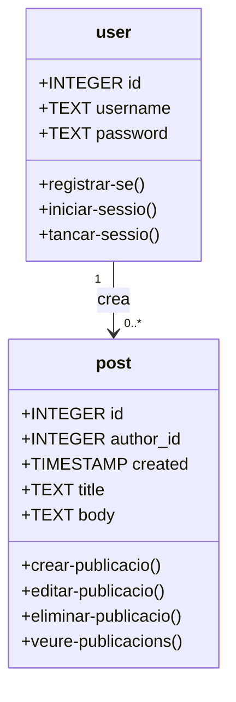

```mermaid

classDiagram
    class user {
        +INTEGER id
        +TEXT username
        +TEXT password
        +registrar-se()
        +iniciar-sessio()
        +tancar-sessio()
    }

    class post {
        +INTEGER id
        +INTEGER author_id
        +TIMESTAMP created
        +TEXT title
        +TEXT body
        +crear-publicacio()
        +editar-publicacio()
        +eliminar-publicacio()
        +veure-publicacions()
    }
    user "1" --> "0..*" post : crea

```
